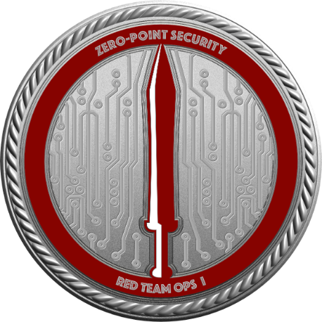

<h2 align="left"> Hello!!!1!</h2>

###

###
I'm Amoeba,

### I'm Currently:
 | Scheduling my Certified Red Team Operator exam

 | Self-teaching C for Malware Development

 | Learning x86 Assembly for Malware Analysis

 | Studying for my OSCP exam

###
<!--

-->

<!--GitHub Stats -->
 

  
  

-------

### > Vocational
I'm currently a Security Engineer & Internal Pentester. I also do Malware Analysis/Development, some physcial Red Teaming, and Infrastructure Engineering.
### > Personal
I'm a wannabe polymath and citizen scientist:
- I do Microbiology research (particularly Protozoology)
- I love Astrophotography
- Various CompSci projects, including tool development for other fields.

-------

## Languages
<!--Languages Table -->
<table border="0" style="border-collapse: collapse; width: 100%;">
  <tr align="center">
    <th style="border: none; padding: 8px;"></th>
    <th style="border: none; padding: 8px;">Language</th>
    <th style="border: none; padding: 8px;">Usage</th>
  </tr>
  <tr align="center" style="border: none;">
    <td style="border: none; padding: 8px;"></td>
    <td style="border: none; padding: 8px;">C</td>
    <td align="left">Malware Development & eventual tool finalization</td>
  </tr>
  <tr align="center">
    <td style="border: none; padding: 8px;"></td>
    <td style="border: none; padding: 8px;">Python</td>
    <td align="left">Scripting & tool development</td>
  </tr>
    <tr align="center">
    <td style="border: none; padding: 8px;"></td>
    <td style="border: none; padding: 8px;">PowerShell</td>
    <td align="left">Scripting & tool development</td>
  </tr>
  <tr align="center" style="border: none;">
    <td style="border: none; padding: 8px;"></td>
    <td style="border: none; padding: 8px;">Bash & Batch</td>
    <td align="left">Simple system scripting</td>
  </tr>
  <tr align="center" style="border: none;">
    <td style="border: none; padding: 8px;"></td>
    <td style="border: none; padding: 8px;">FalconQL</td>
    <td align="left">CrowdStrike SIEM query lang</td>
  </tr>
  <tr align="center" style="border: none;">
    <td style="border: none; padding: 8px;"></td>
    <td style="border: none; padding: 8px;">KQL</td>
    <td align="left">Microsoft 365 Defender's 'Advanced Threat Hunting' Query lang</td>
  </tr>
  <tr align="center">
    <td style="border: none; padding: 8px;"></td>
    <td style="border: none; padding: 8px;">GraphQL</td>
    <td align="left">API Interaction</td>
  </tr>
  <tr align="center" style="border: none;">
    <td style="border: none; padding: 8px;"></td>
    <td style="border: none; padding: 8px;">Terraform</td>
    <td align="left">(Primarily AWS) Infrastructure as Code lang.</td>
  </tr>
</table>

###

-------

<!-- Profile Views -->

  

